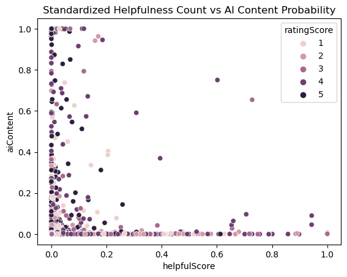
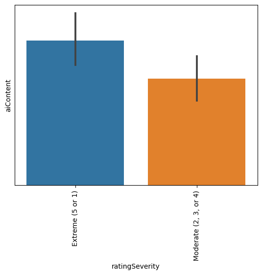
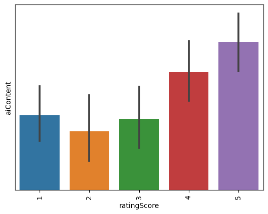
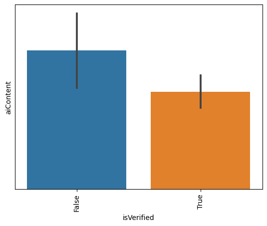
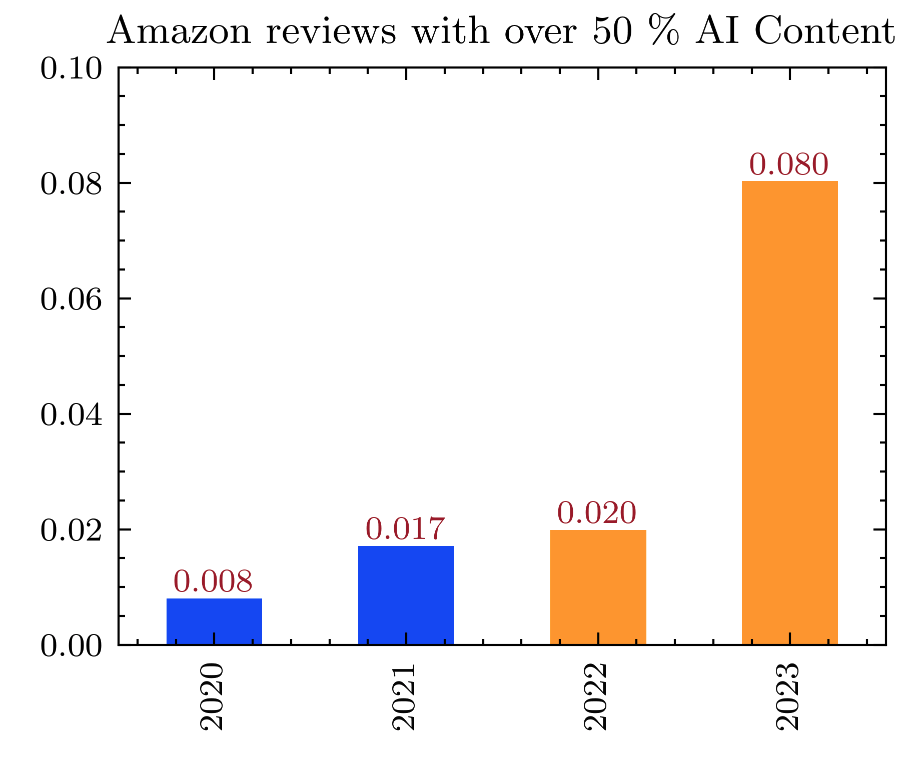

# Overview

A dataset of 2K Amazon product reviews from 2019 to August 2023 (time of publication) were analyzed for AI Content, and its relationship with other features.

## Data

Approximately 26K product review records was retrieved from Amazon. After cleaning and removal of sensitive and identifying customer information, 2K records were processed with Originality.AI's AI Detection API. The state-of-the-art model analyzes text data for the likelihood of AI Content and returns a probability score of 0-100%

## Methodology

### Features Engineering

- `helpfulScore` was derived by standardizing `helpfulCount` on the geometric mean of `totalCategoryRatings` and `totalCategoryReviews`.
- `ratingSeverity` was derived by binarizing `ratingScore` into Extreme and Moderate values.

### Statistical Tests

All functions are from the `scipy.stats` package library.

- Analysis of aiContent against categorical features was performed with `f_oneway` one-way ANOVA testing. For the case of comparing categorical data against numerical data, it tests against the Null hypothesis that the two features are not correlated.
- Analysis of aiContent against numerical features was performed with `pearsonr`, `kendalltau` and `spearmanr`. They test for the null Hypothesis that the features are not correlated.
- Analysis of the distribution of the sample data, to confirm that it's representative of the raw data was performed with `ks_2samp`, `chisquare`, and `entropy`. The first two tests for the null hypothesis that 2 independent samples are drawn from the same continuous distribution. The last is a test of the difference in the distributions.

### Trend Analysis

Trend Analysis was done by converting `aiContent` into a binary feature and aggregating its annual averages.

## Results

### Key Findings

- Roughly 400% rise in `aiContent` trend from 2022 to 2023. Chat GPT launched on November 30, 2022.
- Correlation between `aiContent` and `ratingSeverity`, `ratingScore` and `isVerified`.
- Negative correlation(~-6%) between `helpfulScore` and `aiContent`.

# Conclusion

Studies are still ongoing. More data will be required for deeper analysis and findings of statistical confidence. The results so far are interesting and it will be worthwhile to look into the data from an e-commerce website with less rigorous review monitoring.
